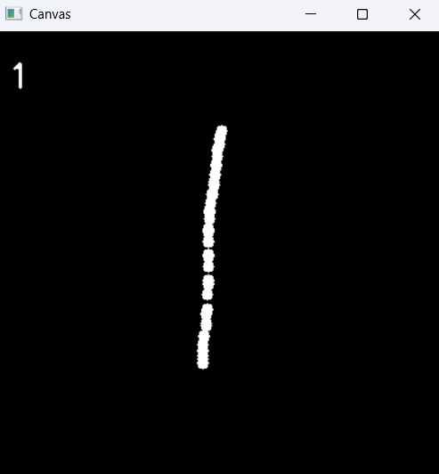
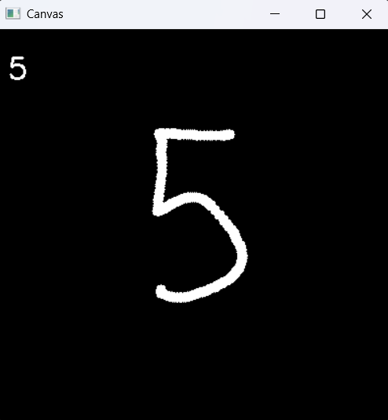
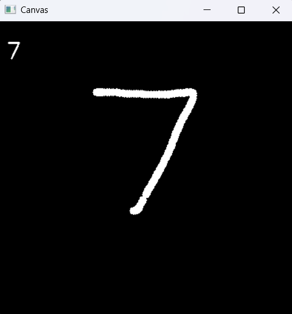

# Real-Time MNIST Digit Classification

## Overview

This project implements a real-time digit classification system using the MNIST dataset and a Convolutional Neural Network (CNN). The model is trained on the MNIST dataset and deployed in a real-time interactive application where users can draw digits on a canvas, and the trained model predicts the drawn digit.

## Features

- **MNIST Dataset Preprocessing**: Loads and preprocesses the MNIST dataset for training.
- **CNN Model for Classification**: A deep learning model is implemented using TensorFlow/Keras to classify handwritten digits.
- **Model Training & Evaluation**: The model is trained on the dataset and evaluated for accuracy.
- **Real-Time Digit Recognition**: Users can draw digits on a canvas, and the model predicts them in real-time using OpenCV.
- **Visualization**: Accuracy and loss graphs are plotted for model performance evaluation.

## Technologies Used

- Python
- TensorFlow/Keras
- OpenCV
- NumPy
- Matplotlib

## Installation

To run this project, install the required dependencies using pip:

```bash
pip install tensorflow opencv-python numpy matplotlib
```

## Usage

### Running the Jupyter Notebook

1. Execute the cells in sequential order to:
   - Load and preprocess the MNIST dataset.
   - Define and train the CNN model.
   - Evaluate the model on the test set.
   - Launch real-time digit recognition using OpenCV.

### Real-Time Digit Recognition

- Run all cells in the Jupyter Notebook until the real-time recognition section.
- Draw digits on the OpenCV canvas.
- Press `p` to predict the drawn digit.
- Press `c` to clear the drawn digit.
- Press `q` to exit the application.

## Training Results

- The model achieves high accuracy (\~99%) on the MNIST dataset.
- The training accuracy and loss trends are visualized using Matplotlib.

## Example Output






## Future Enhancements

- Deploying the model as a web application

